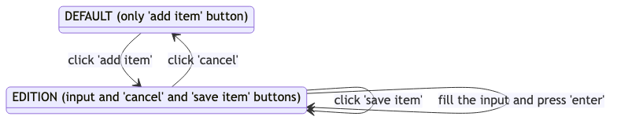

# Vue.js Fundamentals

This repository is a template for you to follow the course [Vue.js Fundamentals](https://vueschool.io/courses/vuejs-fundamentals).

This Vue.js course [Vue School](https://vueschool.io/courses/vuejs-fundamentals) will teach you and get you up and running with the basics concepts of Vue.js. 

You can find this free course by **Vue School** at [vueschool.io](https://vueschool.io/courses/vuejs-fundamentals). 
The course is suitable for developers who do not yet know about Vue.js or are just getting started with Vue.

See also [Annotated Reading of the Essentials Section of the Vue.js Guide](https://crguezl.github.io/learning-vue-geting-started-guide)

## TODOS for the Shopping list app

Follow the course and build the *Shopping List* web app.

1. Leave your solution in the file [index.html](index.html) of the `main` branch, initially empty.
2. There is a file [main.css](main.css) with the styles used during the course. Use it.
3. The file [solution.html](solution.html) contains the final solution. Check your progress against it.
4. You can check how it has to look at the end here <https://crguezl.github.io/vuejs-fundamentals/solution.html>

Be sure to follow these steps:

### Initial Steps

- [  ] Write initial HTML with a shopping-list div
- [  ] Load and Instanciate Vue add data and Vue template syntax to interpolate
- [  ] Add an input an synchronize it with the interpolated text to see it
- [  ] Explore the app in the console
- [  ] Discuss the syntax of JS inside moustaches
- [  ] Learn to read the errors in the console
- [  ] Add items to data and show them using v-for
- [  ] Use Vue Devtools. Configure it to work with file://
- [  ] Add v-on: Start by simulating in the console what we are going to do
- [  ] Add button to add the new item when clicked
- [  ] Add v-on:keyup.enter to the input element
- [  ] Shorthands for v-on 
- [  ] Use a method `saveItem` to factorice
- [  ] Reset the input when finished the insertion
- [  ] Check the method using the debugger
- [  ] v-if and v-else: add a conditional message when the list is empty

### Next Steps: Add State to your App

Add a `state` variable to the app `data` to represent the states of the app. 
There will be two states: **default** and **edition**. 
The views on each state will be different

State **edition** corresponds to when the user is adding/editing a new item: there will be an **input** form to input the item, buttons to **cancel** the edition, to **save the item**, etc.


State **default** corresponds to when the user is the initial state. There will be a button to **add** a new item 


Here is the DFA with the transitions:



- [  ] Show the `div` with class `add-item-form` only if the state is `edition`
- [  ] Add a div with class `header` with two buttons: one for adding an item and the other for cancelling the edition
- [  ] Show the  `add button` only if the state is `default` and the `cancel` button  when it is not
- [  ] Add the `changeState` method that reflect the transitions between both states 


## v-bind steps

- [ ] Disable the button `save item` when the `input` is empty by binding the `disabled` attribute of the button

## Dynamic classes with v-bind

- [  ] Change the list of items from a list of Strings to a list of Objects with `label` and `purchased` attributes. Update the `saveItem` method and the template accordingly
- [  ] Make use of the class `.strikeout` in the css file:

  ```css
  .strikeout {
    text-decoration: line-through;
    color: #B8C2CC;
  } 

  .strikeout:hover {
      color: #8795A1;
  }
  ```

 to style the purchased items. Use first the *object syntax* `v-bind:class="{myclass: expression}"` and later the *array syntax* `v-bind:class=[exp1, exp2]`


## Topics

- Introduction to two-way data binding
- Template syntax and expressions
- Vue directives, loops and conditional rendering
- Vue Devtools
- Handling user Inputs
- Handling Events
- Vue.js Methods
- Attribute Bindings and dynamic classes


